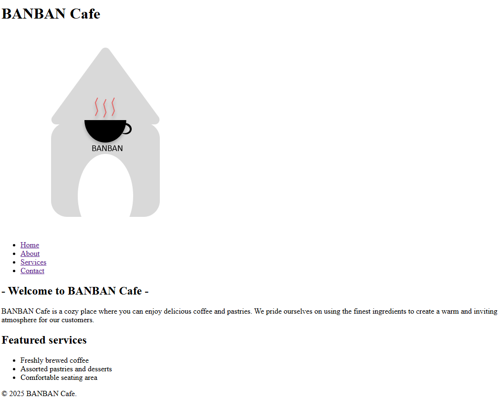
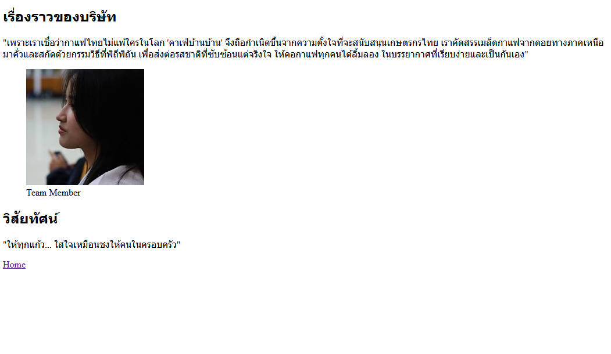
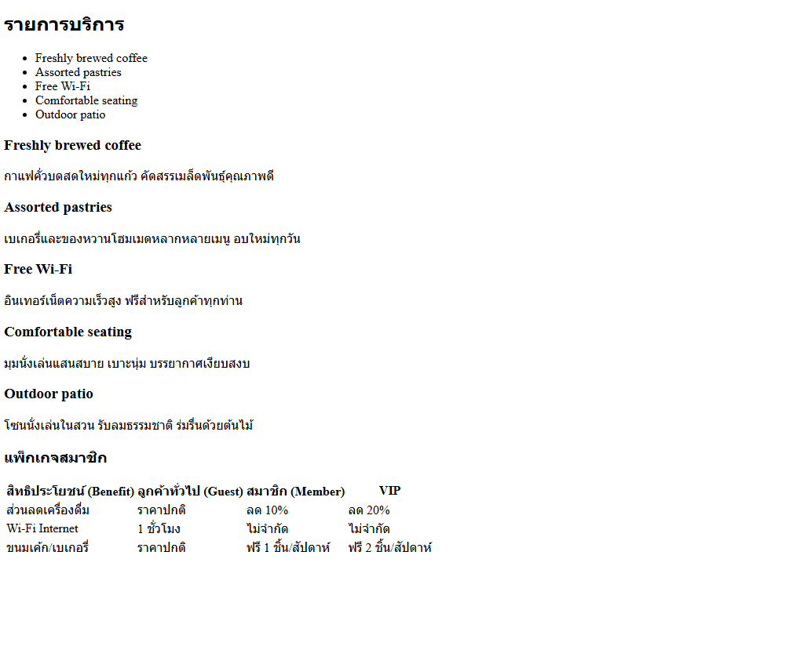
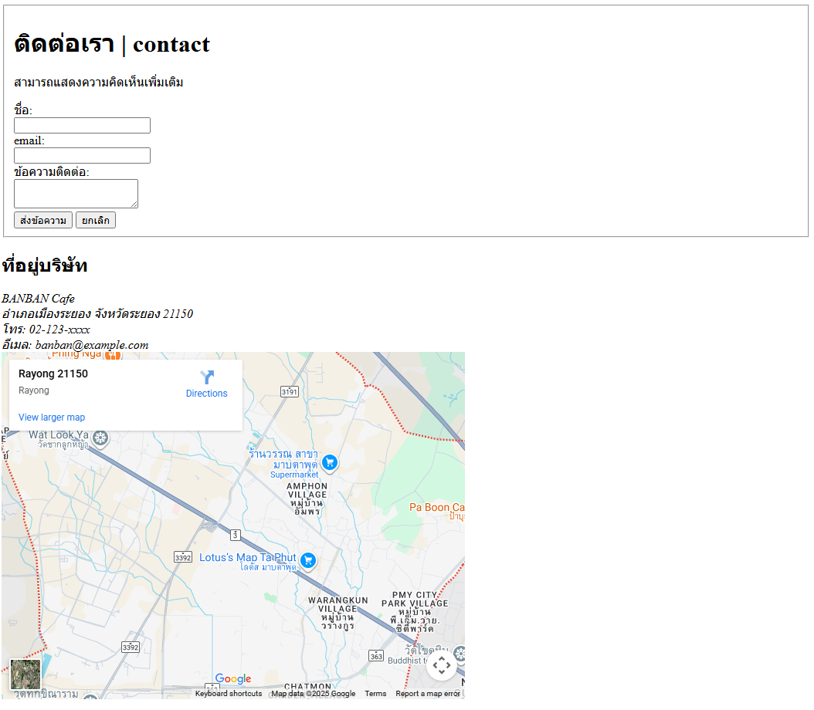

# BanBan Cafe Website Project

โปรเจกต์เว็บไซต์สำหรับธุรกิจจำลอง "คาเฟ่บ้านบ้าน" (Baan Baan Cafe) เขียนโครงสร้างด้วย HTML5

## 📝 รายละเอียดโปรเจกต์ (Project Description)

เว็บไซต์นี้เป็น Static Website ที่ประกอบด้วย 4 หน้าหลัก เพื่อนำเสนอข้อมูลของร้านคาเฟ่ ได้แก่:

1. **หน้าแรก (Home):** นำเสนอภาพรวม จุดเด่น และบรรยากาศของร้าน
2. **เกี่ยวกับเรา (About):** บอกเล่าเรื่องราว (Story), วิสัยทัศน์ (Vision) และทีมงาน
3. **บริการ (Services):** รายละเอียดเมนู บริการต่างๆ และตารางเปรียบเทียบแพ็กเกจสมาชิก
4. **ติดต่อเรา (Contact):** ข้อมูลที่อยู่ แผนที่ และฟอร์มติดต่อ

## โครงสร้างไฟล์ (File Structure)

```text
root/
├── index.html       # หน้าแรก
├── about.html       # หน้าเกี่ยวกับเรา
├── services.html    # หน้าบริการและตารางราคา
├── contact.html     # หน้าติดต่อเรา
└── README.md        # เอกสารอธิบายโปรเจกต์
```

## 📸 รูปหน้าจอทั้งหมด (Screenshots)

### 1. หน้าแรก (Home)



### 2. หน้าเกี่ยวกับเรา (About)



### 3. หน้าบริการ (Services)



### 4. หน้าติดต่อเรา (Contact)



## ลิงก์เข้าแต่ละหน้า (Page Links)

คลิกเพื่อเปิดดูหน้าต่างๆ:

- [ หน้าแรก (Home)](./index.html)
- [ เกี่ยวกับเรา (About)](./about.html)
- [ บริการของเรา (Services)](./services.html)
- [ ติดต่อเรา (Contact)](./contact.html)
